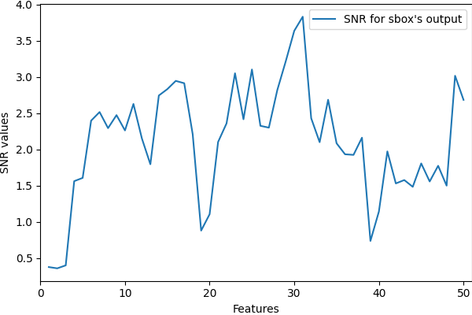
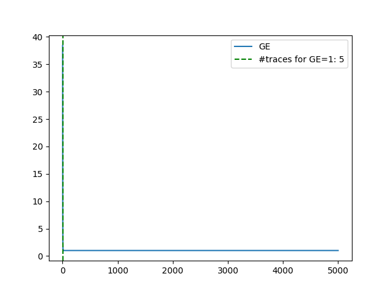

# This is the source code for the paper "LD-PA: Distilling Univariate Leakage for Deep Learning-based Profiling Attacks".

## LD-PA framework:


## Usage:
1. Preparing the target dataset and downsampling (if needed).
2. <a href=./src/train.py>Train</a> a model with LD-PA paradigm. 
3. <a href=./src/evaluate.py>Evaluate</a> the model. 

## An example of LD-PA is given in the Jupyter Notebook <a href=example.ipynb>file</a>.
- Training loss <a href=log_ASCADv_ASCADf2_s0.log>log</a>
- Saved best model at epoch 17 (./model_ASCADv_ASCADf2_s0.pth).
- Evaluation results: 
    - SNR for sbox's output.
        
    - Guessing Entropy.
        

## Note:
 More information can be found in the paper.
 ```@article{author2024title,
  title={Your Paper Title},
  author={Author, First and Another, Second},
  journal={Journal Name},
  year={2024},
  volume={42},
  number={3},
  pages={123-456},
  doi={10.1000/j.journal.2024},
}```
